# Flex Canvas

Authenticated realtime collaborative whiteboard built with Next.js, Supabase Auth/Postgres metadata, Liveblocks custom Storage/presence, React Konva, and OpenAI Responses API.

Deployed app: `https://collabboard-six-kappa.vercel.app`

## Stack

- Next.js App Router + TypeScript
- Supabase Auth, profiles, boards, memberships, AI command logs
- Liveblocks private room auth, custom `objects` Storage, and presence
- React Konva for custom rendering, selection, drag, resize, pan, and zoom
- OpenAI `gpt-5.5` with `reasoning.effort = medium`

This custom version removes tldraw to demonstrate more custom engineering. React Konva is responsible for rendering and interaction, while Liveblocks custom Storage is the canonical board state. Supabase remains auth and metadata only, and no custom WebSocket server is used.

## Environment

Required:

```bash
NEXT_PUBLIC_SUPABASE_URL=
NEXT_PUBLIC_SUPABASE_ANON_KEY=
SUPABASE_SERVICE_ROLE_KEY=
LIVEBLOCKS_SECRET_KEY=
OPENAI_API_KEY=
OPENAI_MODEL=gpt-5.5
OPENAI_REASONING_EFFORT=medium
NEXT_PUBLIC_APP_URL=http://localhost:3000
NEXT_PUBLIC_CUSTOM_CANVAS_ENGINE=true
```

`NEXT_PUBLIC_CUSTOM_CANVAS_ENGINE=true` keeps the merged custom React Konva and Liveblocks
Storage implementation active. The flag defaults on so local and production builds use the
custom-engineered path unless it is explicitly disabled.

## Development

```bash
npm install
npm run dev
```

Supabase migrations:

```bash
supabase link --project-ref <project-ref>
supabase db push
```

Validation:

```bash
npm run lint
npm run typecheck
npm run build
npm run test:visual
npm run test:smoke
```

Use `npm run test:smoke:prod` to run the same 5-user multiplayer, sync, reconnect, AI, 500-object, and FPS smoke against the deployed Vercel app.

## Documentation



- Architecture: `docs/ARCHITECTURE.md`
- Architecture diagram source: `docs/ARCHITECTURE_DIAGRAM.mmd`
- Architecture diagram export: `public/demo/flex-canvas-architecture.svg`
- Pre-search notes: `docs/PRE_SEARCH.md`
- Test plan: `docs/TEST_PLAN.md`
- AI development log: `docs/AI_DEVELOPMENT_LOG.md`
- AI cost analysis: `docs/AI_COST_ANALYSIS.md`
- Demo video notes: `docs/DEMO_VIDEO.md`
- Submission checklist and demo/social draft: `docs/SUBMISSION_CHECKLIST.md`
- Submission closeout tasks and Mermaid diagram draft: `docs/SUBMISSION_CLOSEOUT_TASKS.md`
- Final compliance audit: `docs/FINAL_COMPLIANCE_AUDIT.md`
- Completion audit: `docs/COMPLETION_AUDIT.md`

## Write Ownership

- Human create, drag, edit, resize, delete: client-owned Liveblocks Storage mutations for low latency.
- Cursor, selection, and online status: client-owned Liveblocks Presence only.
- AI commands, templates, batch layout, and multi-object operations: server-owned Liveblocks Storage mutations for authority, validation, logging, and consistency.
- Supabase stores auth, profiles, board metadata, memberships, and AI logs only.

## Deployment

Deploy to Vercel only after Supabase, Liveblocks, and OpenAI variables are configured. This app does not run a WebSocket server; Liveblocks supplies the realtime transport.

Production alias: `https://collabboard-six-kappa.vercel.app`. Direct Vercel deployment URLs are deployment-specific.
Latest production smoke artifact: `test-results/collabboard-smoke-prod-latest.json`.
Latest production visual similarity artifact: `test-results/reference-ui-similarity-prod-latest.json`.
Latest local visual similarity artifact: `test-results/reference-ui-similarity-local.json`.
Latest full local smoke artifact: `test-results/flex-canvas-smoke-local.json`.
Draft local demo video artifact: `output/demo/flex-canvas-demo-draft.mp4`.
Public draft demo video: `https://collabboard-six-kappa.vercel.app/demo/flex-canvas-demo-draft.mp4`.
Public screenshots: `https://collabboard-six-kappa.vercel.app/demo/flex-canvas-home-desktop.png`,
`https://collabboard-six-kappa.vercel.app/demo/flex-canvas-board-desktop.png`,
and `https://collabboard-six-kappa.vercel.app/demo/flex-canvas-home-mobile.png`.
Public architecture diagram: `https://collabboard-six-kappa.vercel.app/demo/flex-canvas-architecture.svg`.
