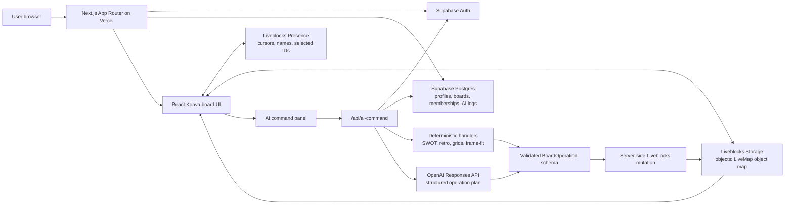

# Submission Closeout Tasks

Status as of Thursday, May 14, 2026.

MVP was submitted Tuesday, May 12, 2026. The app is close to final submission readiness. The remaining work is mostly final proof, packaging, and presentation artifacts rather than core product buildout.

The PDF lists early submission as Friday, May 15, 2026 at 11:59 PM. Its final-deliverables page lists Sunday, May 17, 2026 at 10:59 PM CT, so treat that earlier Sunday time as the safe final cutoff.

## PDF Requirement Pass

- [x] MVP gate: infinite board, pan/zoom, sticky notes, shape creation, object create/move/edit, realtime sync, cursors, presence, auth, and public deployment.
- [x] Core board features: sticky notes, shapes, lines, connectors, text, frames, transforms, selection, delete, duplicate, copy, and paste.
- [x] Realtime collaboration: 5-user smoke, cursor latency, object sync latency, refresh persistence, reconnect recovery, and 500+ object capacity are covered by existing reports.
- [x] AI board agent: deterministic and OpenAI-backed operations cover creation, manipulation, layout, complex templates, shared state, and simultaneous commands.
- [x] Required technical docs: README, architecture, pre-search, test plan, AI development log, AI cost analysis, completion audit, and final compliance audit exist.
- [x] Public app and GitHub repo links exist in the submission checklist.
- [ ] Final demo video: current draft exists, but a polished 3-5 minute recording should be produced before final submission.
- [ ] Social post: draft exists, but should only be published after explicit approval.
- [ ] Repository transfer: request was sent to `jakekinchen`; acceptance still needs confirmation.

## Remaining High-Priority Tasks

- [ ] Commit and push the frame layering fix and this closeout doc.
- [ ] Deploy the latest `main` to Vercel after the frame fix is pushed.
- [ ] Run `npm run test:smoke:prod` against the final deployment.
- [ ] Run `npm run test:visual:prod` against the final deployment.
- [ ] Refresh `docs/SUBMISSION_CHECKLIST.md` with the final deployment URL, latest smoke report, latest visual report, and final video URL.
- [ ] Confirm the public app still supports auth, Liveblocks room auth, and OpenAI commands after the final deploy.

## Demo Video Checklist

Target length: 3 to 5 minutes.

- [ ] Sign in or continue as guest, then create/open a board.
- [ ] Show two browser users in the same board with named cursors and presence.
- [ ] Create and edit a sticky note.
- [ ] Create rectangle, circle or line, arrow connector, text, and frame.
- [ ] Show the frame acting as a background organizer, not covering notes.
- [ ] Move, recolor, duplicate, copy, and paste objects.
- [ ] Drag-select multiple objects and resize/rotate one object.
- [ ] Run deterministic AI commands: SWOT, retrospective, user journey, sticky grid, even spacing, and frame-fit resize.
- [ ] Run one OpenAI-backed freeform command.
- [ ] Refresh a second browser to prove persistence.
- [ ] Explain architecture boundaries: Supabase for auth and metadata, Liveblocks for realtime storage and presence, React Konva for rendering, server-side AI mutation for board operations.

## Mermaid Architecture Diagram

- Source: `docs/ARCHITECTURE_DIAGRAM.mmd`
- Exported SVG: `public/demo/flex-canvas-architecture.svg`
- Exported PNG: `public/demo/flex-canvas-architecture.png`
- Public SVG after deploy: `https://collabboard-six-kappa.vercel.app/demo/flex-canvas-architecture.svg`

## Nice-To-Have Polish Before Final

- [x] Export the Mermaid diagram as PNG and SVG for the README, social post, or demo video.
- [ ] Record fresh screenshots from the final deployment after the frame layering fix.
- [ ] Add a short note to the demo script that frames organize content areas but intentionally do not move nested objects in this MVP.
- [ ] Re-check mobile board usability after the final deployment.
- [ ] Confirm GitHub transfer acceptance or note it as pending in the final handoff.
